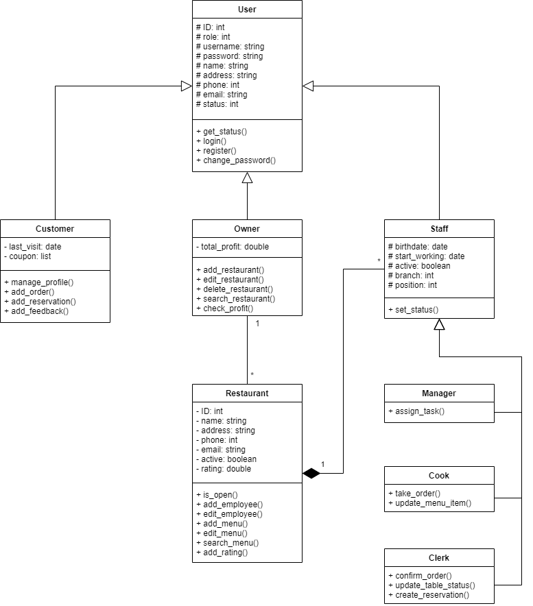
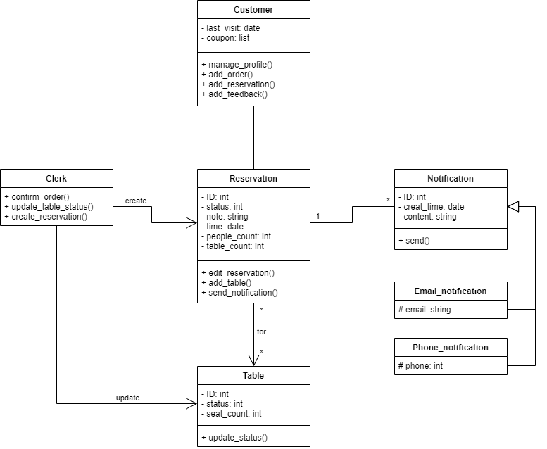
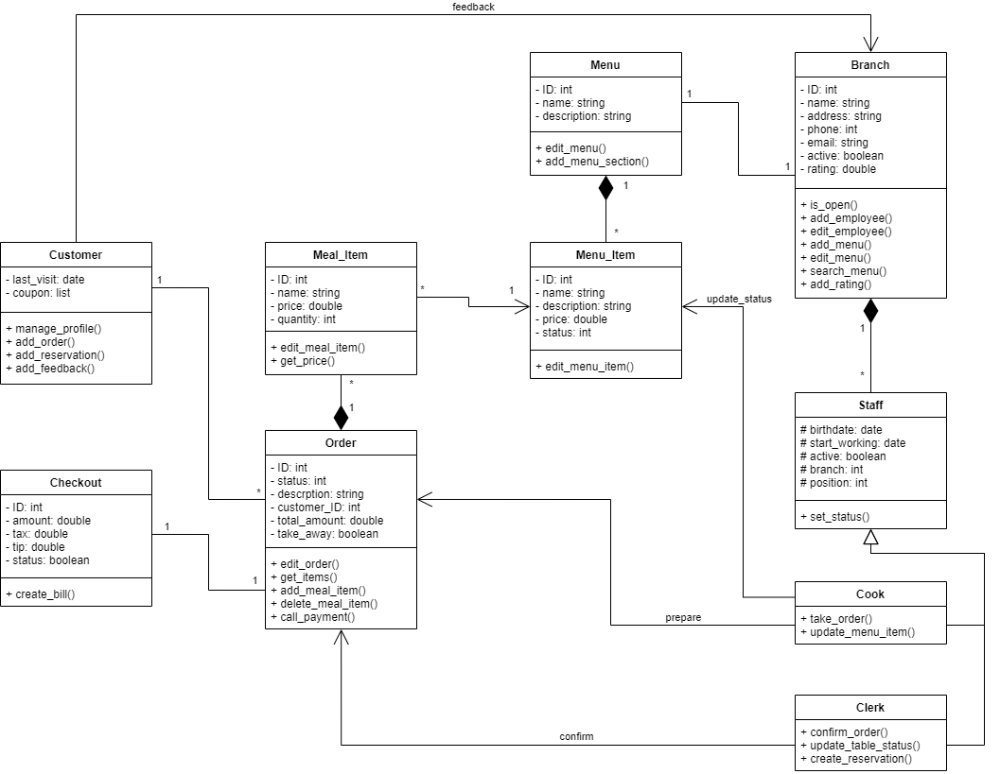
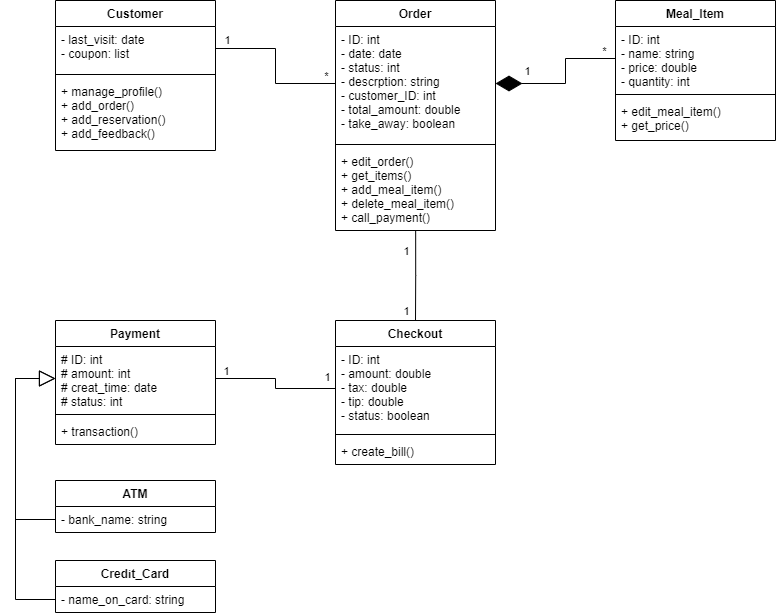
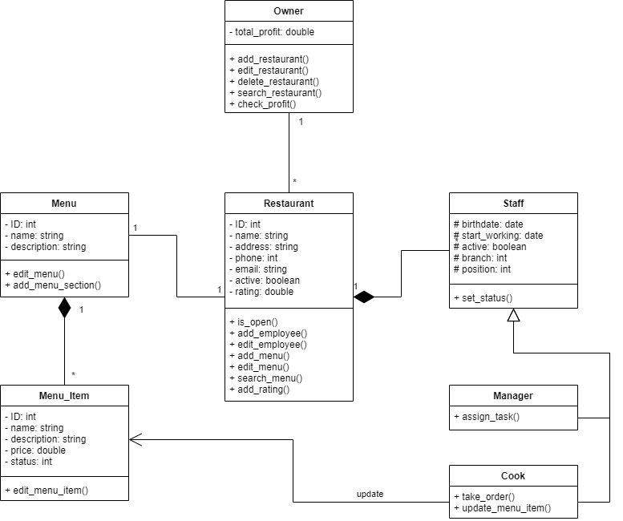

# SYSTEM MODELING FOR POS-SYSTEM

1. Activity diagram for login function

* Customer can login or register an account 

2. Activity diagram for table reservation function

* After loggin in, customer can make a table reservation on a specifc date and time

3. Activity diagram for food-ordering function

* Customer can order food, use coupons or set take-away time

4. Activity diagram for payment and order-confirmation function

* Customer choose the payment method for the order or cancel order

5. Activity diagram for menu-update function

* Chef or owner can change the detail of specific items

6. Activity diagram for menu-add function

* Owner can add a specific item to the menu

7. Sequence diagram for food-ordering and confirmation function

8. Class diagram for the POS-system

* The "Login" Class Diagram for the POS system:

    

* The "Reserve Table" Class Diagram for the POS system:

    

* The "Order Food" Class Diagram for the POS system:

    

* The "Make Payment" Diagram for the POS system:

    

* The "Create Menu" Diagram for the POS system:

    

